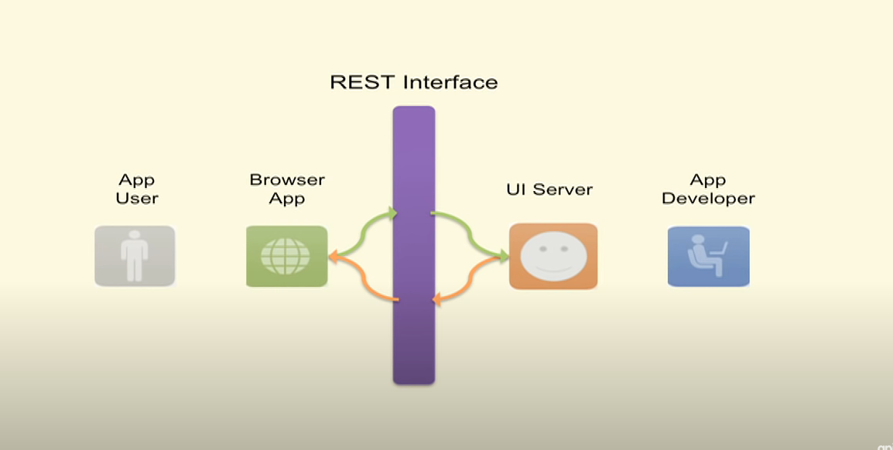

# REST

## Client

- The client is the person or software who uses the API. It can be a developer, for example you, as a developer, can use Twitter API to read and write data from Twitter, create a new tweet and do more actions in a program that you write. Your program will call Twitter’s API. The client can also be a web browser. When you go to Twitter website, your browser is the client who calls Twitter API and uses the returned data to render information on the screen.

## Resource

- a resource can be any object the API can provide information about. In Instagram’s API, for example, a resource can be a user, a photo, a hashtag. Each resource has a unique identifier. The identifier can be a name or a number.

### Nouns and Verbs

- Resources are located at a specific URL.
- We interact using HTTP (HTTPS) requests
- This is done through the use of the HTTP verbs

## Express and Sequelize CRUD Summary 🖊

## Rest Interface

